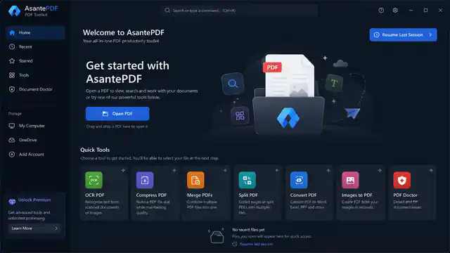
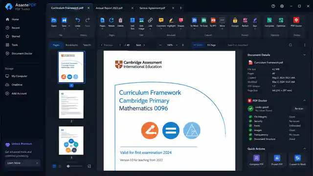

# AsantePDF Visual Direction

These images are canonical UI references supplied for the AsantePDF redesign and are stored inside the repository so the target look survives across chats and development sessions.

## Home target

The Home experience should feel like a real launcher, not an empty PDF canvas. It should surface Open PDF, standalone quick tools, Recent, Starred/Pinned, session resume, storage/account areas where supported, and application-level navigation.

## Document Workspace target

The Document Workspace should provide a real multi-document desktop editing environment with tabs, grouped command ribbon, page/bookmark/search navigation, document canvas, page controls, search, contextual document details, PDF Doctor status and relevant quick actions.

## Interpretation rules

- The screenshots define overall hierarchy, density, spacing, polish and dark-theme direction.
- They are not mockups to imitate while leaving controls non-functional.
- Commands must obey the context-aware rules in master items 44 and 15.
- The right-side Inspector/Doctor must be contextual and must not show fake recommendations before analysis.
- The Home screen and Document Workspace are separate application modes.
- Use a coherent professional icon family. Do not use emoji as interface icons.
- Light mode must be equally complete even though these references show the dark visual direction.
- Accessibility, scaling and high-DPI requirements in the master specification remain mandatory.

## Fidelity note

The repository copies are embedded renderable reference snapshots of the user-supplied target screens. The master specification remains authoritative for labels, behaviour and feature completeness. Visual similarity without working behaviour does not satisfy acceptance.
